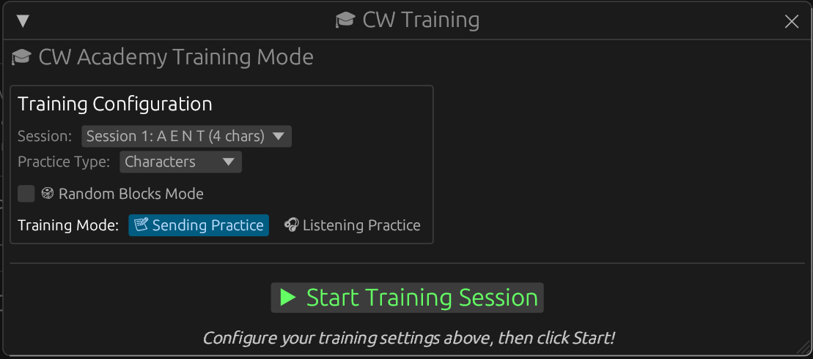

# 🎹 Morse Code Paddle Decoder - Cross-Platform

**Real-time Morse code decoder with beautiful GUI**

✅ **Works on Linux, Windows, and macOS**

---

## 🌟 Features

- **Beautiful GUI** with adjustable WPM (5-40) and frequency (300-1000 Hz)
- **Real-time decoding** of paddle inputs via MIDI
- **Audio feedback** with adjustable tone
- **Visual indicators** showing paddle status
- **Cross-platform** - runs on Linux, Windows, and macOS
- **Full Morse code support** - all letters, numbers, and punctuation

---


Debian Linux / Linux Mint


/etc/udev/rules.d/49-digispark.rules 

```
# Digispark ATtiny85
SUBSYSTEMS=="usb", ATTRS{idVendor}=="16d0", ATTRS{idProduct}=="0753", MODE:="0666"
KERNEL=="ttyACM*", ATTRS{idVendor}=="16d0", ATTRS{idProduct}=="0753", MODE:="0666", ENV{ID_MM_DEVICE_IGNORE}="1"

# Digispark ATtiny167
SUBSYSTEMS=="usb", ATTRS{idVendor}=="16d0", ATTRS{idProduct}=="0753", MODE:="0666"
```


## 📦 Quick Start by Platform

### 🐧 **Linux**
See: [BUILD_LINUX.md](BUILD_LINUX.md)

### 🪟 **Windows**  
See: [BUILD_WINDOWS.md](BUILD_WINDOWS.md)

### 🍎 **macOS**
See: [BUILD_MACOS.md](BUILD_MACOS.md)

---

## 🔌 Hardware Setup (All Platforms)

### **Required Hardware:**
- ATtiny85 Digispark board
- Iambic paddle or straight key
- USB cable

### **Wiring:**
```
ATtiny85 Pin 2 (P2)  →  LEFT paddle (Dit)
ATtiny85 Pin 0 (P0)  →  RIGHT paddle (Dah)
ATtiny85 GND         →  Paddle common ground
```

### **Programming the ATtiny85:**
1. Install Arduino IDE (available for all platforms)
2. Add Digispark board support:
   - File → Preferences → Additional Board Manager URLs
   - Add: `[http://digistump.com/package_digistump_index.json](https://raw.githubusercontent.com/digistump/arduino-boards-index/master/package_digistump_index.json)`
3. Tools → Board → Board Manager → Install "Digistump AVR Boards"
4. Install DigiMIDI library (Sketch → Include Library → Manage Libraries)
   https://github.com/heartscrytech/DigisparkMIDI 
6. Open `paddle_decoder.ino`
7. Tools → Board → Digispark (Default - 16.5mhz)
8. Sketch → Upload (plug in Digispark when prompted)

---

## 🚀 Building and Running

### **All Platforms - General Steps:**

1. **Install Rust** (if not installed):
   ```bash
   # Visit https://rustup.rs and follow instructions for your platform
   ```

2. **Install platform-specific dependencies** (see platform guides above)

3. **Build the application:**
   ```bash
   cd paddle_decoder_cross_platform
   cargo build --release
   ```

4. **Run it:**
   ```bash
   cargo run --release
   ```

---

## 🎮 Using the GUI


### **Visual Interface:**


**Main Interface:**


**In Action:**



### **Controls:**
- **Drag WPM slider** - Adjust speed (5-40 WPM)
- **Drag Frequency slider** - Change tone (300-1000 Hz)
- **Click "Add Space"** - Insert space in decoded text
- **Click "Clear Text"** - Reset decoded text

### **Visual Feedback:**
- 🔴 **RED** - Paddle currently pressed
- ⚪ **GRAY** - Paddle released
- 🔵 **BLUE** - Current sequence (dots/dashes)
- 🟢 **GREEN** - Decoded text

---

## ⏱️ Timing Information

**At 20 WPM:**
- **Dit:** 60ms
- **Dah:** 180ms (3× dit)
- **Letter gap:** 300ms (5× dit) - triggers character decode
- **Word gap:** 420ms (7× dit)

The decoder waits 300ms after your last paddle press to decode the character. This gives you comfortable timing between elements!

---

## 🔧 Troubleshooting

### **Common Issues (All Platforms):**

**No MIDI device found:**
- Check Digispark is plugged in
- Verify LED blinks 5 times on startup
- Check if `paddle_decoder.ino` is uploaded

**No sound:**
- Check system volume
- Test with other audio applications
- Verify audio output device is selected

**Characters decoding wrong:**
- Timing issue - try adjusting WPM slider
- Make sure to pause 300ms between letters

### **Platform-Specific Issues:**

See platform-specific build guides:
- Linux: [BUILD_LINUX.md](BUILD_LINUX.md)
- Windows: [BUILD_WINDOWS.md](BUILD_WINDOWS.md)
- macOS: [BUILD_MACOS.md](BUILD_MACOS.md)

---

## 📚 Morse Code Reference

### **Letters:**
```
A .-    J .---   S ...
B -...  K -.-    T -
C -.-.  L .-..   U ..-
D -..   M --     V ...-
E .     N -.     W .--
F ..-.  O ---    X -..-
G --.   P .--.   Y -.--
H ....  Q --.-   Z --..
I ..    R .-.
```

### **Numbers:**
```
0 -----    5 .....
1 .----    6 -....
2 ..---    7 --...
3 ...--    8 ---..
4 ....-    9 ----.
```

### **Punctuation:**
```
.  .-.-.-   ?  ..--..
,  --..--   !  -.-.--
/  -..-.    @  .--.-.
```

### **Prosigns (Special Sequences):**
```
<BK> -..-.-   Break (pause in transmission)
<AR> .-.-.    End of message
<BT> -...-    Break text / new paragraph (same as "=")
<SK> ...-.-   End of contact / Silent Key
```
**Note:** Prosigns are sent without gaps between the elements (as one continuous sequence).  
**Note:** `<BT>` and `=` share the same Morse pattern (`-...-`), so the decoder shows `=` for this pattern.

---

## 🎯 Tips for Best Results

1. **Start slow** - Begin at 15 WPM and work your way up
2. **Consistent timing** - Try to maintain steady rhythm
3. **Clear pauses** - Wait full 300ms between letters
4. **Watch indicators** - Visual feedback helps build muscle memory
5. **Practice common letters** - Start with E, T, I, A, N, M

---

## 📝 Project Structure

```
paddle_decoder_cross_platform/
├── Cargo.toml              # Rust project configuration
├── paddle_decoder.ino      # ATtiny85 firmware
├── src/
│   └── main.rs            # Main application
├── README.md              # This file
├── BUILD_LINUX.md         # Linux build guide
├── BUILD_WINDOWS.md       # Windows build guide
└── BUILD_MACOS.md         # macOS build guide
```

---

## 🤝 Contributing

This is an open-source project for the amateur radio community. Feel free to:
- Report bugs
- Suggest features
- Submit pull requests
- Share your improvements

---

## 📜 License

Free for amateur radio and educational use.

---

## 🆘 Support

**Having issues?**
1. Check the platform-specific build guide
2. Review troubleshooting section above
3. Verify hardware connections
4. Test with provided diagnostics

---

## 73! 📻

**Happy decoding!**

Built with ❤️ for the amateur radio community
